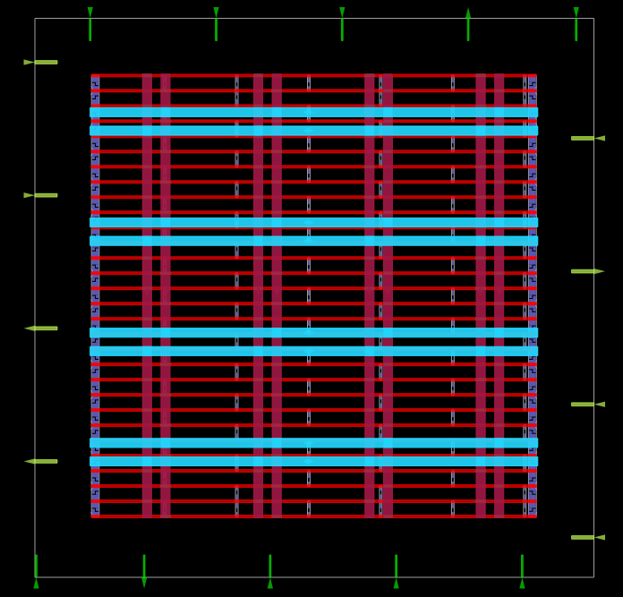
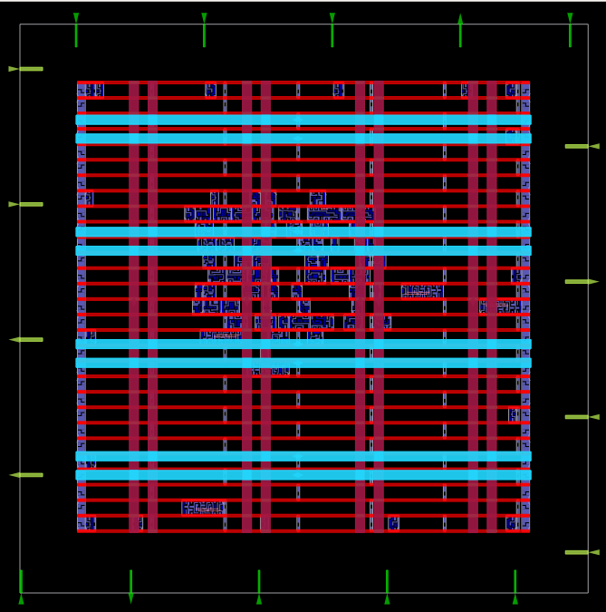
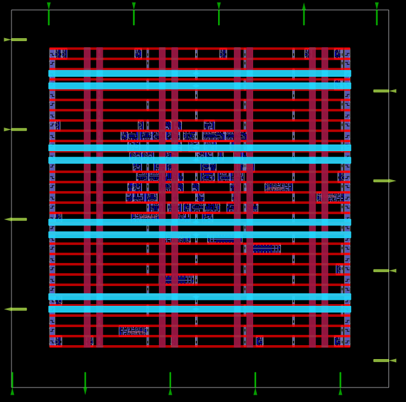
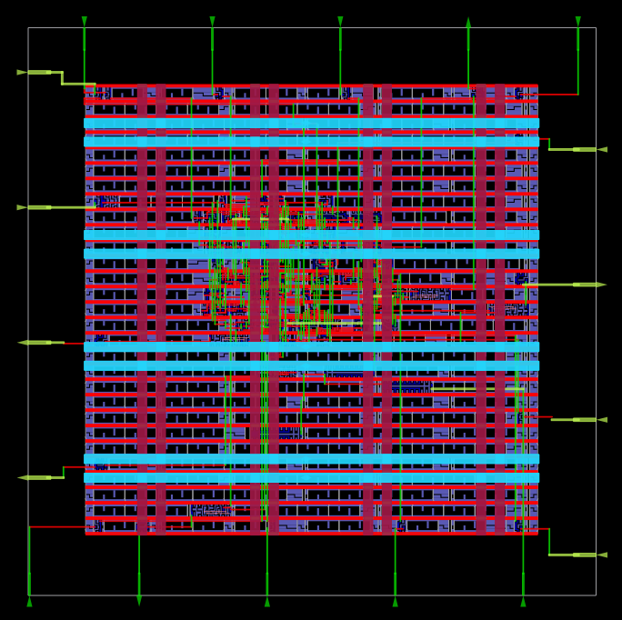
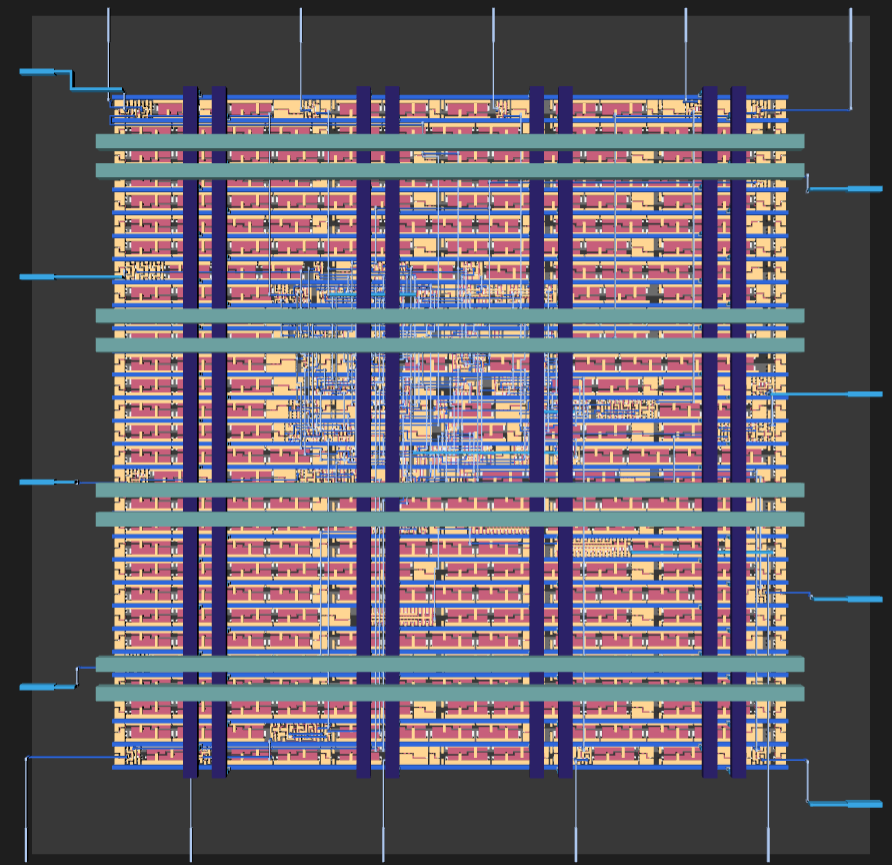

# RTL-to-GDS Implementation of an ALU using OpenLane and SKY130

A complete RTL-to-GDS implementation of a 5-bit Arithmetic Logic Unit (ALU) using the OpenLane ASIC flow and the SKY130 Open PDK. This project demonstrates the complete digital ASIC implementation flow, starting from RTL design in Verilog and ending with the generation of the final GDSII layout.

---

## Overview

The objective of this project is to implement a synthesizable ALU in Verilog and take it through the complete ASIC physical design flow using open-source EDA tools. The implementation includes RTL design, functional verification, logic synthesis, floorplanning, placement, clock tree synthesis, routing, timing analysis, physical verification, and GDSII generation.

---

## Design Flow

```text
RTL Design
     │
     ▼
Functional Verification
     │
     ▼
Logic Synthesis
     │
     ▼
Floorplanning
     │
     ▼
Placement
     │
     ▼
Clock Tree Synthesis
     │
     ▼
Global & Detailed Routing
     │
     ▼
Static Timing Analysis
     │
     ▼
DRC / LVS Verification
     │
     ▼
GDSII Generation
```

---

## Repository Structure

```text
alu/
├── src/                 RTL source files
├── reports/             Reports generated during each implementation stage
├── runs/                OpenLane implementation outputs
├── tb_alu_top.v         Testbench
├── alu_top.vcd          Simulation waveform
├── config.json          OpenLane configuration
└── README.md
```

---

## Tools Used

| Tool | Purpose |
|------|---------|
| Verilog HDL | RTL Design |
| OpenLane | RTL-to-GDS Flow |
| OpenROAD | Physical Design |
| Yosys | Logic Synthesis |
| OpenSTA | Static Timing Analysis |
| Magic | Layout Generation & DRC |
| Netgen | LVS |
| GTKWave | Functional Verification |

---

## Technology

- SKY130 HD Standard Cell Library
- OpenLane
- OpenROAD

---

## Implementation Summary

| Parameter | Value |
|-----------|------:|
| Design | Arithmetic Logic Unit (ALU) |
| Top Module | `alu_top` |
| RTL Language | Verilog HDL |
| Technology | SKY130 HD Standard Cell Library |
| OpenLane Flow | Completed |
| Total Standard Cells | 759 |
| Synthesized Logic Cells | 66 |
| Chip Area | 678.15 μm² |
| Core Area | 89.70 × 89.76 μm |
| Die Area | 100 × 100 μm |
| Wire Length | 2303 μm |
| Vias | 643 |
| Worst Negative Slack (WNS) | 0.00 ns |
| Total Negative Slack (TNS) | 0.00 ns |
| Worst Setup Slack | 5.12 ns |
| Worst Hold Slack | 1.84 ns |
| Suggested Clock Period | 10 ns |
| Suggested Clock Frequency | 100 MHz |

---

## Physical Verification

The generated layout successfully completed the physical verification stage.

| Check | Status |
|--------|:------:|
| DRC | ✔ Passed |
| LVS | ✔ Clean |
| Pin Antenna Check | ✔ Passed |
| Net Antenna Check | ✔ Passed |

---

## Generated Outputs

The final implementation includes:

- GDSII Layout
- DEF
- LEF
- Gate-Level Verilog Netlist
- Liberty Timing Library
- SDF
- SPEF
- SPICE Netlist
- Magic Layout

---

## Results

The following images illustrate the major stages of the RTL-to-GDS implementation flow.

### Floorplan

The floorplanning stage defines the die and core dimensions, places the I/O pins, and generates the initial power distribution network.

<p align="center">
  
</p>

---

### Placement

Standard cells are placed within the core while optimizing area utilization and wirelength.

<p align="center">
  
</p>

---

### Clock Tree Synthesis (CTS)

Clock buffers are inserted to distribute the clock signal across all sequential elements while minimizing skew and insertion delay.

<p align="center">
  
</p>

---

### Routing

Signal interconnections are completed using global and detailed routing while satisfying design rule and timing constraints.

<p align="center">
  
</p>

---

### Final GDSII Layout

Final physical layout generated after signoff, ready for fabrication.

<p align="center">
  
</p>

---
## Conclusion

This project demonstrates the complete RTL-to-GDS implementation of a 5-bit ALU using the OpenLane ASIC flow and the SKY130 HD Open PDK. Starting from a synthesizable Verilog design, the implementation successfully progressed through synthesis, floorplanning, placement, clock tree synthesis, routing, static timing analysis, and physical verification, resulting in a manufacturable GDSII layout. The project provided practical experience with the open-source ASIC design flow and the analysis of implementation metrics such as area, timing, and physical verification.


## License

This project is released under the MIT License.
